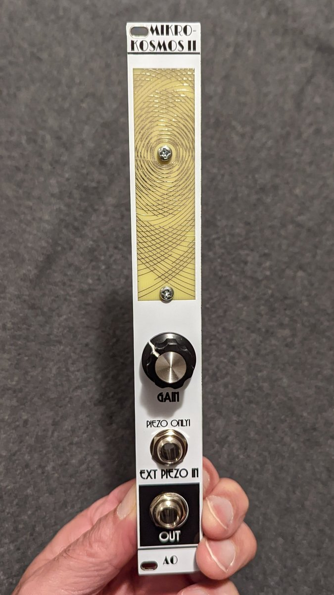

# Mikrokosmos II

This is a synth module in Kosmo format, inspired by Music Thing Modular's [Mikrophonie](https://www.musicthing.co.uk/Mikrophonie/). Like that module, Mikrokosmos II has a piezo pickup attached behind the front panel, and the circuit amplifies the piezo signal and sends it to the output. There is a tactile scratch area on the front panel. You can use your fingernail or a guitar pick to scrape across it and generate output. It will also pick up sounds when you tap or thump on the synth case, plug or unplug cables, and so on. People have attached springs to the front panel, even a coil spring type doorstop. There are lots of possibilities.

There also is a jack for plugging in an external piezo pickup attached to a cable.

The first version of Mikrokosmos was a Kosmo conversion of the Mikrophonie circuit. Mikrokosmos II replaces that circuit with one based on a [design](https://www.logosfoundation.org/g_texts/Orfeus/preamps/piezo_disks.html) by composer, performer, and instrument maker Godfried-Willem Raes. This preamp is designed specifically for piezo pickups and gives better frequency response than a typical constant impedance amplifier.

## About the name

Mikrophonie's name comes from that of a [composition](https://en.wikipedia.org/wiki/Mikrophonie_(Stockhausen)) by Karlheinz Stockhausen. "Mikrokosmos" is an obvious portmanteau of "Mikrophonie" and "Kosmo", and pays homage to a [collection of piano pieces](https://en.wikipedia.org/wiki/Mikrokosmos_(Bart%C3%B3k)) with that name by Béla Bartók. Apparently it also is the name of a song by BTS, but that has nothing to do with this module.

## Current draw
? mA +12 V, ? mA -12 V

## Photos



## Documentation

* [Schematic](Docs/mikrokosmos-ii.pdf)
* PCB layout: [front](Docs/mikrokosmos-ii_layout_front.pdf), [back](Docs/mikrokosmos-ii_layout_back.pdf)
* [BOM](Docs/mikrokosmos-ii_bom.md)
* [Build notes](Docs/build.md)

## GitHub repository

* [https://github.com/holmesrichards/mikrokosmosii](https://github.com/holmesrichards/mikrokosmosii)

## Submodules

This repo uses submodules aoKicad and Kosmo_panel, which provide needed libaries for KiCad. To clone:

```
git clone git@github.com:holmesrichards/microkosmos-ii.git
git submodule init
git submodule update
```


Alternatively do

```
git clone --recurse-submodules git@github.com:holmesrichards/microkosmos-ii.git
```

Or if you download the repository as a zip file, you must also click on the "aoKicad" and "Kosmo\_panel" links on the GitHub page (they'll have "@ something" after them) and download them as separate zip files which you can unzip into this repo's aoKicad and Kosmo\_panel directories.

If desired, copy the files from aoKicad and Kosmo\_panel to wherever you prefer (your KiCad user library directory, for instance, if you have one). Then in KiCad, go into Edit Symbols and add symbol libraries 

```
aoKicad/ao_symbols
Kosmo_panel/Kosmo
```
and go into Edit Footprints and add footprint libraries 
```
aoKicad/ao_tht
Kosmo_panel/Kosmo_panel.
```
